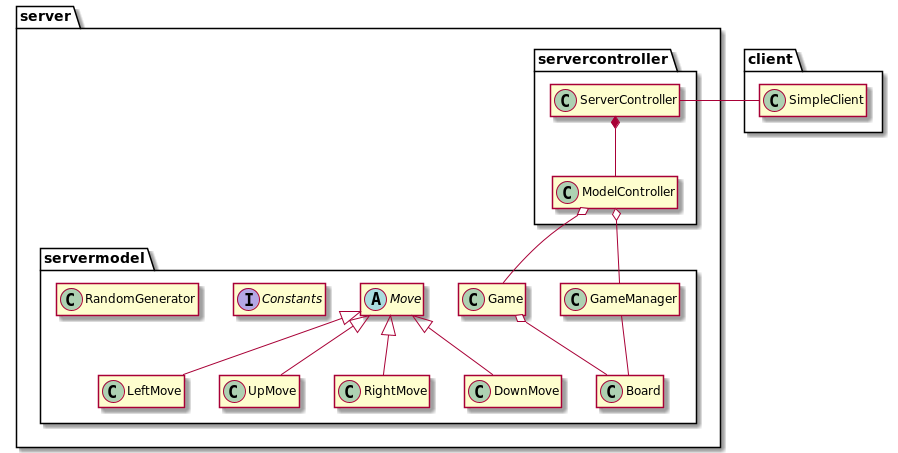
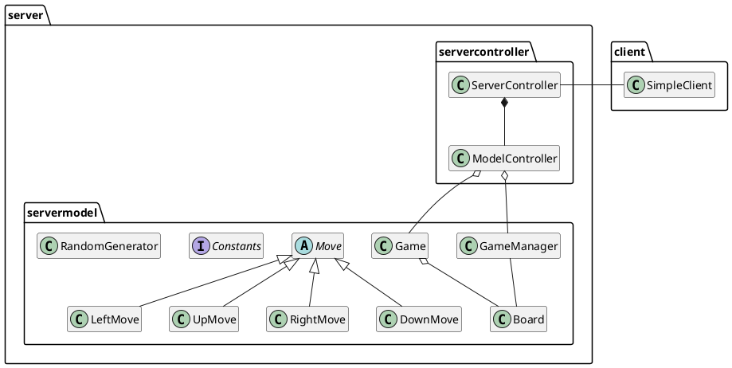

# Toolshop Project - ENSF 607/608
UML diagram name: Avtex - 2048 Game
 
Created by: Patrick Linang
 
Date: April 5, 2021

## UML Diagram for server

Note that Constants, RandomGenerators, and Move implementations have use dependencies with other models in the server

### PlantUML code
