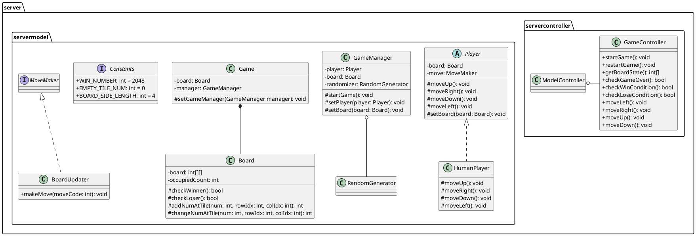

# Toolshop Project - ENSF 607/608
UML diagram name: Avtex - 2048 Game
 
Created by: Patrick Linang
 
Date: April 5, 2021

## UML Diagram for server
### PlantUML code

```plantuml
@startuml
skinparam classAttributeIconSize 0

package server {
    package servercontroller {
        class GameController {
            + startGame(): void
            + restartGame(): void
            + getBoardState(): int[]
            + checkGameOver(): bool
            + checkWinCondition(): bool
            + checkLoseCondition(): bool
            + moveLeft(): void
            + moveRight(): void
            + moveUp(): void
            + moveDown(): void
        }
        class ModelController
    }

    package servermodel {
        class Board {
            - board: int[][]
            - occupiedCount: int
            # checkWinner(): bool
            # checkLoser(): bool
            # addNumAtTile(num: int, rowIdx: int, colIdx: int): int
            # changeNumAtTile(num: int, rowIdx: int, colIdx: int): int
        }
        
        abstract class Player {
            - board: Board
            - move: MoveMaker
            # moveUp(): void
            # moveRight(): void
            # moveDown(): void
            # moveLeft(): void
            # setBoard(board: Board): void
        }

        class HumanPlayer implements Player {
            # moveUp(): void
            # moveRight(): void
            # moveDown(): void
            # moveLeft(): void
        }

        class GameManager {
            - player: Player
            - board: Board
            - randomizer: RandomGenerator
            # startGame(): void
            # setPlayer(player: Player): void
            # setBoard(board: Board): void
        }

        class RandomGenerator {
            
        }

        class Game {
            - board: Board
            - manager: GameManager
            # setGameManager(GameManager manager): void
        }

        interface Constants {
            + WIN_NUMBER: int = 2048
            + EMPTY_TILE_NUM: int = 0
            + BOARD_SIDE_LENGTH: int = 4
        }

        interface MoveMaker {
        }

        class BoardUpdater implements MoveMaker {
            + makeMove(moveCode: int): void
        }
    }

ModelController o- GameController
GameManager o-- RandomGenerator
Game *-- Board

hide members
@enduml
```